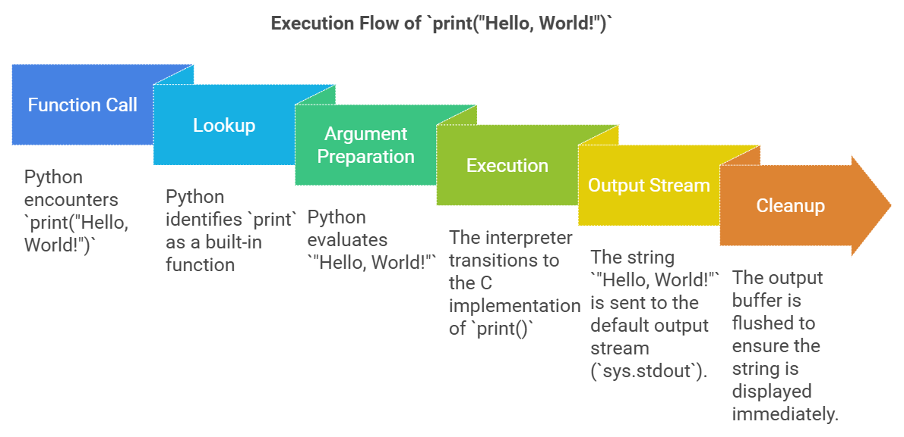

## Understanding Functions in Python
  ### Functions in Python are blocks of reusable code designed to perform a specific task. 
  #### Types of Functions:
**1. Built-in Functions:** These are pre-defined functions that come with Python.
  **Examples:**
  - **print():** Displays output to the console.
  - **len():** Returns the length of a string, list, etc.
  - **sum():** Adds all elements in an iterable.
**Example:**
```python
numbers = [1, 2, 3]
print(len(numbers))  # Output: 3
```
**2. User-defined Functions:** These are functions that you create yourself to perform specific tasks.
  **Syntax:**
```python
def function_name(parameters):
    # code block
    return result
```
**Example:**
```python
def greet(name):
    return f"Hello, {name}!"
print(greet("Subbu"))  # Output: Hello, Subbu!
```
**3. Functions from Modules:** Python allows you to import functions from external modules or libraries. 
**Example:**
```python
import math
print(math.sqrt(16))  # Output: 4.0
```


    

---
  ### Internal Flow of Function Execution in Python for the `print()` Function:

  **1. Function Call:** Python encounters print("Hello, World!").
  
  **2. Lookup:** Python identifies print as a built-in function.
  
  **3. Argument Preparation:**
  
  - Python evaluates "Hello, World!".
    
  **4. Execution:**
  
  - The interpreter transitions to the C implementation of print().
  - The string "Hello, World!" is sent to the default output stream (sys.stdout).
    
  **5. Cleanup:** The output buffer is flushed to ensure the string is displayed immediately.
  
  **6. Return:** The function completes and returns None.
  
  
   ### Complete Flow Diagram of print("Hello, World!"):
   
   

   ---

